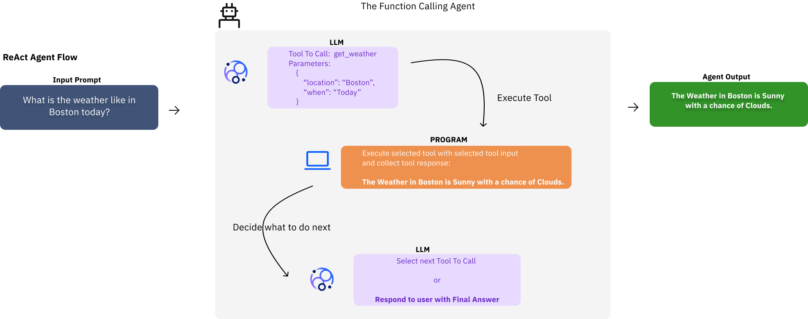

# Function Calling Agent

Agent developers can build agents with many different architectures. But we believe that any project involving the development of an agent should always start from the same place: that is, validating whether or not a simple **Function Calling Agent** is able to meet the requirements of the desired use cases.

All agent architectures likely call some functions or tools. So what does it mean to be a simple Function Calling Agent Architecture?

**Definition**: **Function Calling (FC)** is a capability offered out of the box by most chat tuned or instruction tuned models. In this architecture, each model can select from a set of functions or tools to aide in information collection, before responding to the end user query.

In its most basic incarnation, an FC Agent is nothing more than:

- An LLM informed about a toolkit or function set.
- A program able to execute the function or tools from the toolkit.

The flow for an FC Agent is:

1. A user sends a query to the FC Agent.
2. The FC Agent routes the query to the LLM.
3. The LLM responds with either:
    1. a final answer; then the answer is sent back to the user. Done!
    2. or a tool to use; then the program executes the tool.
4. Upon completion, the result of the tool execution is sent back to the LLM with the original query.
5. Repeat step 3 until a final answer is received.



/// caption
FC Agent Flow Example
///

/// info | Tool execution
A common misconception is that the LLM underlying the Agent is able to execute tools, when in fact the LLM is only selecting a tool and the tool parameters to execute based on the query. The tool execution is performed by the program supplementing the LLM invocations.
///

## Prerequisites

This lab is a [Jupyter notebook](https://jupyter.org/). Please follow the instructions in [pre-work](../pre-work/README.md) to run the lab.

## Lab

[]({{ config.repo_url }}/blob/{{ git.commit }}/{{ notebook }}){:target="_blank"}
[]({{ extra.colab_url }}/blob/{{ git.commit }}/{{ notebook }}){:target="_blank"}

To run the notebook from your command line in Jupyter using the active virtual environment from the [pre-work](../pre-work/README.md#install-jupyter), run:

```shell
jupyter notebook {{ notebook }}
```

The path of the notebook file above is relative to the `granite-agent-workshop` folder from the git clone in the [pre-work](../pre-work/README.md#clone-the-workshop-repository).
